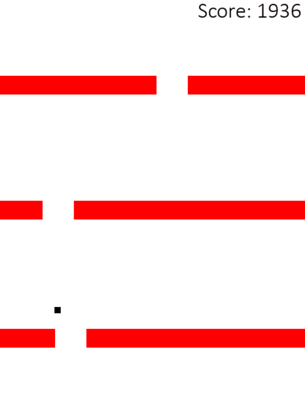
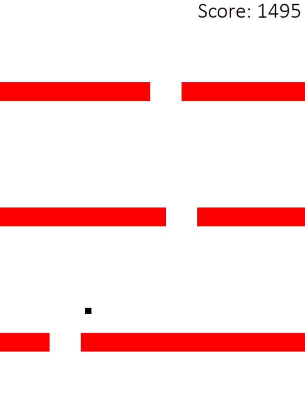

# DotProject

Genetic Algorithm with NEAT (NeuroEvolution of Augmenting Topologies) for dot objects learning to consistently navigate randomly-generated obstacles. Project originally done in November 2022.

NEAT: https://neat-python.readthedocs.io/en/latest/neat_overview.html

Inspired by CodeBullet: https://www.youtube.com/watch?v=BOZfhUcNiqk&ab_channel=CodeBullet

Behavior after around 20 generations:  
  

Behavior after around 50 generations:  

